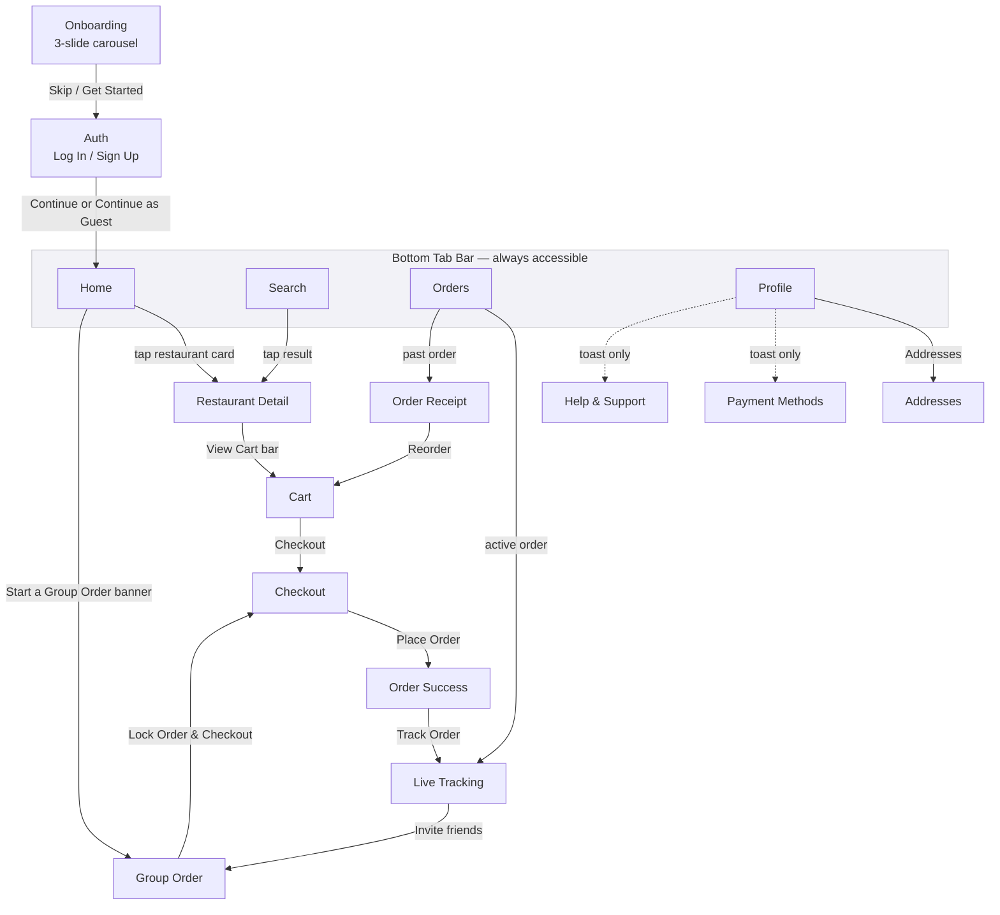

# Nomly Prototype — Navigation Map

This documents every screen-to-screen connection built into the clickable prototype (`prototype.html`), grouped by the five flows from the wireframing phase. Use it alongside the prototype when walking a stakeholder or test participant through the app, or when adding new screens later.

## Full flow diagram

## Screens in this prototype (14)

| # | Screen | Reached from | Transition |
|---|--------|--------------|------------|
| 1 | Onboarding | App launch | — |
| 2 | Auth (Log In / Sign Up) | Onboarding | Slide in |
| 3 | Home (tab) | Auth, any tab | Root |
| 4 | Restaurant Detail | Home card, Search result | Push (slide in) |
| 5 | Cart | Floating cart bar | Push |
| 6 | Checkout | Cart, Group Order | Push |
| 7 | Order Success | Checkout — Place Order | Push, checkmark draw-on animation |
| 8 | Live Tracking | Order Success, active order in Orders tab | Push, auto-advancing status + moving courier marker |
| 9 | Group Order | Home banner, Tracking screen | Push |
| 10 | Search (tab) | Home search bar, tab bar | Root |
| 11 | Orders (tab) | Tab bar | Root, Active/Past segmented control |
| 12 | Order Receipt | Orders — past order | Push |
| 13 | Profile (tab) | Tab bar, Home avatar | Root |
| 14 | Addresses | Profile | Push |

## Transition conventions used

- **Push** (forward navigation): new screen slides in from the right, back chevron appears top-left.
- **Back**: previous screen slides in from the left; pops the navigation stack.
- **Tab switch**: no slide animation — treated as a root-level jump, resets the stack for that tab.
- **Micro-interactions**: quantity steppers, toggle switches, payment/tip selection, star rating, and the tracking status bar all update in place without a screen change.

## Known simplifications (by design, for prototype scope)

- Cart is single-restaurant at a time (adding from a second restaurant clears the first, with a toast explaining why).
- "Lock Order & Checkout" in Group Order routes to the same Checkout screen as a normal order — it doesn't merge participant totals into the payable amount.
- Payment Methods and Help & Support are stubbed with a toast rather than full screens, since they don't affect the core flows being tested.

These are worth flagging explicitly in a design review so nobody mistakes them for bugs.
